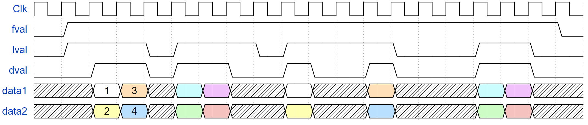

# VideoBus

Verification Components for VideoBus interface. VideoBus is a simple protocol to stream video using fval (frame valid) / lval (line valid) / dval (data valid). It is commonly used to connect rather simple video blocks in a pipe. The signals are derived from the CameraLink standard, which is rather common in industrial cameras. (See: https://www.imagelabs.com/wp-content/uploads/2010/10/CameraLink5.pdf Chapter 2)

Although it is related to VSync, HSync, DataEnable video, there are no real video timings involved. I.e., there is no front porch, back porch, blanking video. 

The library onsists of VideoBusRx for receiving, VideoBusTx for transmitting, and a bitmap logger for visual inspection. An example testbench is included to show how one might use these VCs, using a simple passthrough DUT. Furthermore, the library has a configurable number of data streams, in case multiple pixels are sent per cycle. 

Below is an example of how a 4x4 image may be transmitted over a single data stream. 


When using multiple data streams, multiple sequential pixels are sent simultaneously. Below is an example of how the same 4x4 image may be transmitted over 2 data streams.


Notice that the timing regarding the fval/lval/dval signals is not strict. For example, this would still be a valid transmission of the same 4x4 image:


To this regard, the VideoBusTx VC has 3 model options which can be configured: 
1. FVAL_GUARD_CYCLES: number of cycles between successive frames
2. LVAL_GUARD_CYCLES: number of cycles between successive lines
3. DVAL_GUARD_CYCLES: number of cycles between lval high -> dval high / dval low -> lval low

These are all set to 1 by default, resulting in the timing as shown in the first 2 Figures. 

## Compile OSVVM and run the tests
----------------------------------------------------

If you are using Aldec’s Rivera-PRO or Siemen’s QuestaSim/ModelSim do the following.

* Step 1: Create a directory named sim that is in the same directory that contains the OsvvmLibraries directory.
* Step 2: Start your simulator and go to the sim directory.
* Step 3: Do the following in your simulator command line:

```
source ../OsvvmLibraries/Scripts/StartUp.tcl
build  ../OsvvmLibraries
build  ../OsvvmLibraries/VideoBus/RunAllTests.pro
```

The last command will automatically recompile the ./src directory, and then run all the tests in ./testbench. The received frames will be logged as .bmp images in sim/bmp_logs/bmp_frame_X.
