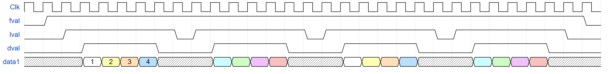
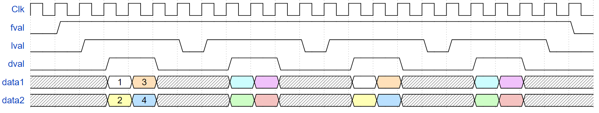

# VideoBus

Verification Components for VideoBus interface. 

Consists of VideoBusRx for receiving and VideoBusTx for transmitting, and a bitmap logger for visual inspection. An example testbench is included to show how one might use these VCs, using a simple passthrough DUT. 

VideoBus is a simple protocol to stream video using fval (frame valid) / lval (line valid) / dval (data valid). The library has a configurable number of data streams, in case multiple pixels are sent per cycle. 

Below is an example of how a 4x4 image may be transmitted over a single data stream. 


When using multiple data streams, multiple sequential pixels are sent simultaneously. Below is an example of how the same 4x4 image may be transmitted over 2 data streams.


## Compile OSVVM and run the tests
----------------------------------------------------

If you are using Aldec’s Rivera-PRO or Siemen’s QuestaSim/ModelSim do the following.

* Step 1: Create a directory named sim that is in the same directory that contains the OsvvmLibraries directory.
* Step 2: Start your simulator and go to the sim directory.
* Step 3: Do the following in your simulator command line:

```
source ../OsvvmLibraries/Scripts/StartUp.tcl
build  ../OsvvmLibraries
build  ../OsvvmLibraries/VideoBus/RunAllTests.pro
```

The last command will automatically recompile the ./src directory, and then run all the tests in ./testbench. The received frames will be logged as .bmp images in sim/bmp_logs/bmp_frame_X.